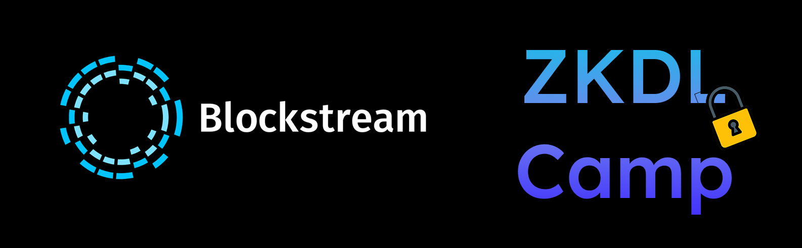

    <h1> ZKDL Camp Lecture Notes </h1>
    

 

This is a series of lectures on zero-knowledge conducted internally at
Blockstream and Distributed Lab, in which we covered essentials for Research and Development 
in the field of zero-knowledge proofs and their applications. 

Currently, the largest problem in zero-knowledge field is the diversity 
of learning material, which is oftentimes either:
- Too high-level, focusing on the applications and not providing the necessary
background in Mathematics and Cryptography.
- Too low-level (such as Protocol papers), which are complete from the
Mathematics and Cryptography standpoints, but are tremendously hard for
practitioners to understand.
- Low-level enough, but incomplete: sometimes, material explains all the
constructions needed to understand a certain protocol, but does not summarize it
into the complete algorithm which is ``implementable''. 

## :books: What to expect?

- We dedicate a significant portion of the book to the **Mathematics**, which is
the foundation of cryptography and zero-knowledge proofs: Number and Group
Theory, Polynomials (Schwartz-Zippel Lemma, in particular), Finite Fields and
Field Extensions.
- Next, we move to the **Cryptographic Preliminaries**, consisting mainly of 
Elliptic Curve Theory: we cover the basics of operations over Elliptic Curves,
Projective Coordinates, and ecpairing. We proceed to the Commitment Schemes
and explain how to formulate security definitions in Cryptography.
- The **Zero-Knowledge Proofs** section is the core of the book. We start with
the basic definitions and classical ZK protocols and proceed to the modern 
constructions, currently consisting of Sigma Protocols, pairing-based zk-SNARKs (R1CS, QAP,
Pinocchio+Groth16, PlonKish Arithmetization), Bulletproofs, Sum-Check protocols (GKR), and lookup tables. However, this is just a beginning: we will add more protocols such as zk-STARKs in the future.

## :open_file_folder: Structure of the repository

The book is fully open-source and all suggestions and contributions are very
welcome! The repository is structured as follows:

| Folder/File | Description |
| --- | --- |
| [`contents`](contents) | Contains the written material for the book in `.tex` format. If you want to add your section/chapter or make corrections to existing ones, you need to navigate to this folder. |
| [`contents/images`](contents/images) | Contains images used in the book sections/lectures. |
| [`presentations`](presentations) | Contains the beamer presentations for the lectures being conducted at Blockstream (and formerly Distributed Lab). Typically, they contain the same material as the corresponding section in the book. However, you might find it easier to grasp the material from them. |
| [`config`](config) | The style/template files for the book. |
| [`book.tex`](book.tex) | The compilation of all lectures in the single file (essentially a book). Uses section files from [`contents`](contents) and compiles them into a single file. |
| [`sage`](sage) | Contains the SageMath code used in some lectures. For the most  part, if the code is present, the separate repository is used, such as for [Sigma Proofs](https://github.com/ZKDL-Camp/lecture-7-sigma) |

## :running_man: Setup to run locally

1. Download LaTeX locally (e.g. [TeX Live](https://www.tug.org/texlive/), if you are using MacOS: [MacTex](https://www.tug.org/mactex/)).
2. Download relevant VSCode extensions: LaTex, LaTex Workshop etc.
3. Clone the repository.
4. Open in VSCode and run the [`book.tex`](./book.tex) file (green arrow at the top of the window).
5. You can also compile each book section separately by following the 
same procedure for the corresponding `.tex` file in the [`contents`](contents) folder.
Note that compiled `.pdf` files are ignored by `.gitignore` and are not pushed to the repository to avoid possible conflicts.

## :books: How to add your lecture?

1. Conduct the steps above and make sure you can compile everything locally.
2. Create a new `.tex` file in the [`contents`](contents) folder in the appropriate chapter folder. Name it in the format `<number>-<topic>.tex`.
3. Add lecture to the [`book.tex`](book.tex) file. For example, if the code looks as:
4. To add the presentation, navigate to the [`presentations`](presentations)
   folder and add the same name as for your lecture file with the appropriate number.

## License

The book is released under the MIT License.